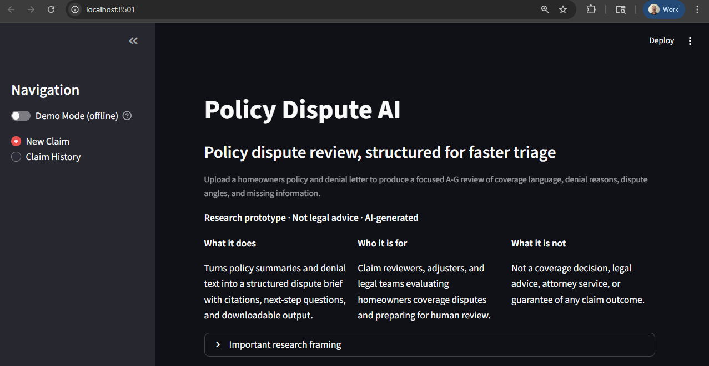
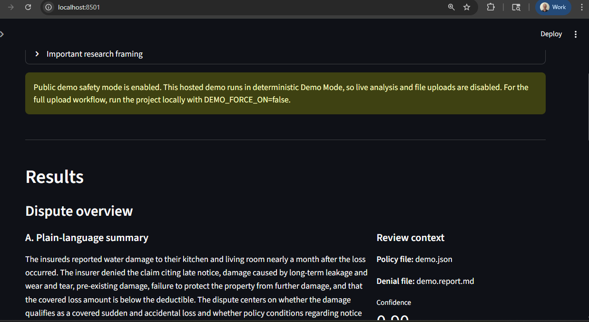
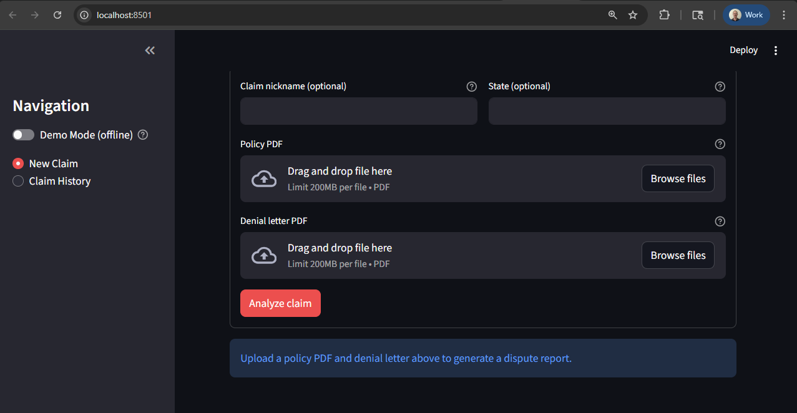
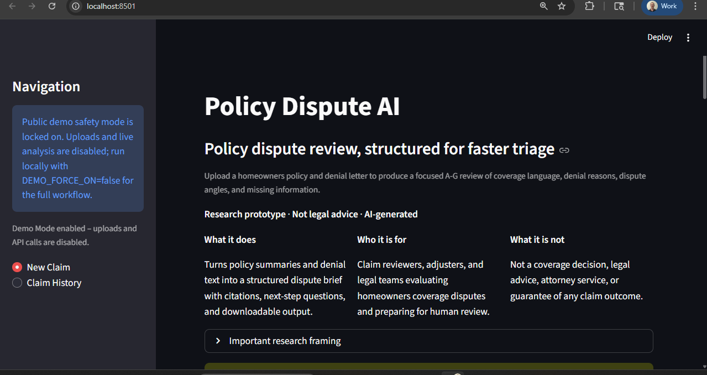
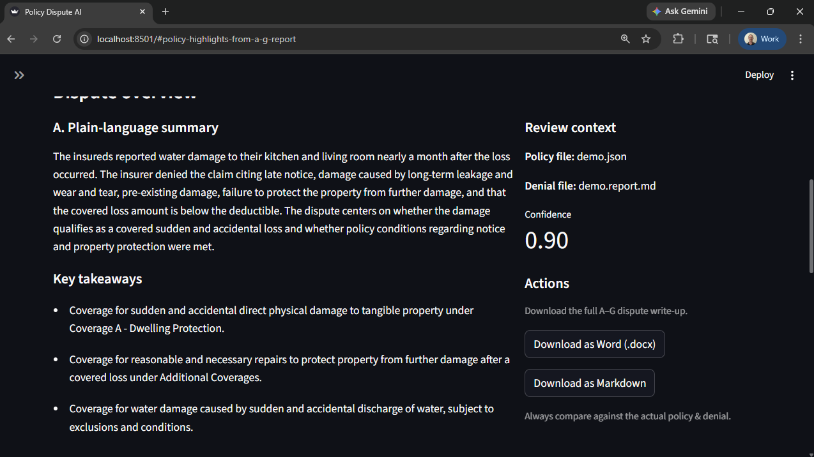

# Policy Dispute AI Assistant

[](https://github.com/itprodirect/policy-dispute-ai-assistant/actions/workflows/ci.yml)

AI assistant for turning homeowners policies and denial letters into dispute‑focused summaries (A–G structure) for public adjusters and attorneys.

> **Status:** Internal prototype / demo, with Phase 1 complete (1A demo polish, 1B technical closeout, 1C local/demo trust polish)
>
> **Frontend:** Streamlit v1 UX (`frontend/app.py`)
>
> **Backend:** Python pipelines in `src/` for policy + denial analysis using OpenAI models

This repo is **not** a legal product. It is an educational / research tool for exploring how LLMs can help with property‑claim disputes.

---

## Preview

The current v1 UX is a Streamlit research demo with explicit AI-generated / not-legal-advice framing, deterministic offline demo support, and a results view built for fast human triage.

Screenshots below use bundled demo-safe artifacts, not real client claim data.

| New claim framing | Results overview |
| --- | --- |
|  |  |

---

## What the app does

Given:

- A homeowners policy PDF (currently optimized for HO3 forms), and
- A denial letter PDF for a specific claim,

…the app:

1. **Extracts and sections the policy** into definitions, coverages, exclusions, conditions, etc.
2. **Summarizes each section** with a custom prompt tuned for HO3‑style language.
3. **Analyzes the denial letter** and maps denial reasons back to relevant policy concepts.
4. **Builds an A–G dispute report** that mirrors how public adjusters and coverage attorneys think about a file:

   - A – Plain‑language overview
   - B – Coverage highlights that may help the insured
   - C – Key exclusions / limitations
   - D – Denial reasons & cited clauses
   - E – Possible dispute angles
   - F – Missing info / suggested next steps
   - G – Confidence notes & clauses to double‑check

5. **Renders the results in a Streamlit UI** with:

   - A “New claim” upload flow with research / not-legal-advice framing, step-based progress status, and a compact Recent claims section when local history exists
   - A **Results** screen with:

     - Hero summary (plain‑language story + key takeaways)
     - Downloadable Markdown report
     - Tabs for Dispute summary (A–G), Policy highlights, Denial reasons & angles, and Confidence.

The goal is to give a **fast triage view** for busy professionals, not to replace full policy / case review.

---

## Screenshots (v1 UX)

These screenshots are intended to show the current demo shape without implying production readiness, legal advice, or real-world claim outcomes.

| View | Screenshot |
| --- | --- |
| **App overview and research framing** – first screen, target audience, and not-legal-advice positioning. |  |
| **New claim upload form** – policy PDF and denial letter upload workflow for local analysis. |  |
| **Public demo safety state** – hosted-demo mode with uploads and API calls disabled. |  |
| **Results overview** – deterministic demo report summary with review context and confidence. |  |
| **Results actions and downloads** – key takeaways plus Word and Markdown export actions. |  |

---

## Project docs

For current project status, architecture, roadmap, and agent workflow notes, start with:

- `docs/01-current-state.md`
- `docs/02-architecture.md`
- `docs/03-roadmap.md`
- `docs/04-agent-workflow.md`

Durable project history lives in:

- `docs/05-decision-log.md`
- `docs/06-heartbeat.md`
- `docs/08-memory.md`
- `docs/09-session-log.md`

---

## Repo structure

```text
policy-dispute-ai-assistant/
├─ assets/
│  └─ demo/                 # Tracked offline demo dispute bundle
│
├─ src/
│  ├─ config.py              # Env + safety flags (SAFE_MODE, PERSIST_RAW_TEXT, etc.)
│  ├─ llm_client.py          # Thin wrapper around OpenAI Responses API
│  ├─ pdf_loader.py          # PDF -> text extraction helpers
│  ├─ sectioning.py          # Split policy into logical sections
│  ├─ summarizer_frontier.py # Build denial-aware A–G report from summaries
│  ├─ report_builder.py      # Turn DisputeReport into Markdown
│  ├─ schemas.py             # Pydantic models for sections and DisputeReport
│  ├─ demo_api.py            # Simple API-style helpers used by the frontend
│  ├─ run_baseline_policy_summary.py   # CLI: summarize policy only
│  └─ run_denial_summary.py            # CLI: summarize denial letters only
│
├─ frontend/
│  ├─ app.py                 # Streamlit v1 UX (current demo)
│  └─ app_v0_minimul.py      # Original single-page prototype (kept for reference)
│
├─ data/
│  ├─ raw_policies/          # Local policy PDFs for CLI runs (gitignored)
│  ├─ raw_denials/           # Local denial inputs for CLI runs (gitignored)
│  ├─ uploads/               # Streamlit upload cache (gitignored)
│  ├─ processed/             # Local generated JSON + Markdown outputs (gitignored)
│  ├─ processed_safe/        # SAFE_MODE generated outputs (gitignored)
│  └─ claims.db              # Local claim history SQLite DB (gitignored)
│
├─ docs/                     # Durable project docs, screenshots, and archived notes
├─ notebooks/                # Experimental notebooks / scratchpads
├─ .env.example              # Sample env vars
├─ requirements.txt          # Python dependencies
└─ README.md                 # You are here
```

---

## Prerequisites

- Python **3.10+**
- An OpenAI API key with access to `gpt-4.1-mini` (or compatible model)

---

## Setup

Clone the repo and create a virtual environment:

```bash
git clone https://github.com/itprodirect/policy-dispute-ai-assistant.git
cd policy-dispute-ai-assistant

python -m venv .venv
# Windows
source .venv/Scripts/activate
# macOS / Linux
# source .venv/bin/activate

pip install -r requirements.txt
```

### Environment variables

Create a `.env` file based on `.env.example`:

```bash
cp .env.example .env  # on Windows: copy .env.example .env
```

Then edit `.env` and set at least:

```bash
OPENAI_API_KEY="sk-..."

# Optional – override default model (defaults to gpt-4.1-mini)
OPENAI_MODEL="gpt-4.1-mini"

# Data-handling flags
SAFE_MODE=true          # when true, raw text is not persisted to disk
PERSIST_RAW_TEXT=false  # only set true if you explicitly want raw text saved
```

The `src/config.py` module enforces these flags strictly:

- If `SAFE_MODE=true`, raw policy/denial text is **never** persisted, even if `PERSIST_RAW_TEXT` was turned on.
- If flags have invalid values, the app will raise a `ConfigError` instead of silently misbehaving.

---

## Running the Streamlit app (v1 UX)

From the repo root, with your virtualenv activated and `.env` configured:

```bash
streamlit run frontend/app.py
```

This will start Streamlit on `http://localhost:8501`.

### Demo Mode (offline)

For a fresh-clone walkthrough with zero API calls, toggle **Demo Mode (offline)** in the sidebar.
The bundled demo-safe dispute report lives in:

- `assets/demo/demo.json`
- `assets/demo/demo.report.md`
- `assets/demo/section_text.json`

These tracked files are deterministic demo artifacts, not real client claim data.

For hosted demos, set `DEMO_FORCE_ON=true`. This locks the app to deterministic Demo Mode, disables file uploads and live analysis, and allows the app to boot without `OPENAI_API_KEY`. Keep `DEMO_FORCE_ON=false` for normal local development and the full upload + LLM workflow.

### New claim flow

1. Go to the **New claim** page (default).
2. Fill in:

   - **Claim nickname** (optional; used in filenames and headings)
   - **State** (optional; future hook for state‑specific guidance)

3. Upload:

   - **Policy PDF** – HO3 form for now (other forms may work but are less tested).
   - **Denial letter PDF** – corresponding denial for this claim.

4. Click **Analyze claim**.
5. Watch the status block as the app walks through:

   - Step 1/4: Analyzing policy
   - Step 2/4: Reading denial letter
   - Step 3/4: Building dispute analysis
   - Step 4/4: Preparing outputs

6. When complete, the page scrolls to the **Results** section.

If local claim history exists, the New Claim page also shows up to two **Recent claims** cards. Their **View** actions reuse the existing Claim History detail view and do not expose raw claim text or report JSON.

### Results view

The results page is split into:

- **Dispute overview**

  - A plain‑language narrative paragraph
  - 2–4 bullet **Key takeaways** for quick gut‑check

- **Actions**

  - Button to **Download dispute report (Markdown)** – can be pasted into Word/Docs as a starting draft

- **Detailed dispute views** (tabs):

  - **Dispute summary (A–G)** – structured expanders for A–G with inline citations
  - **Policy highlights** – checklist view of helpful provisions vs exclusions
  - **Denial reasons** – bullet list of carrier’s reasons mapped to policy concepts
  - **Confidence** – confidence score, notes, and clauses to double-check

Raw A–G JSON and artifact/debug details remain available for developers inside collapsed expanders, but are hidden by default for screenshots and demos.

Under the A–G tab there is an optional **“Full policy breakdown”** section that can show more verbose policy summaries when needed.

---

## CLI utilities (optional)

You can also run the underlying pipelines from the command line without Streamlit.

### Summarize a policy PDF

```bash
python -m src.run_baseline_policy_summary --policy-pdf path/to/policy.pdf
```

Outputs a JSON file like `data/processed/<stem>.json` containing section summaries.

### Summarize a denial letter

```bash
python -m src.run_denial_summary --denial-pdf path/to/denial.pdf
```

Outputs a JSON or Markdown summary for the denial (depending on current implementation).

### Build a combined dispute report (used by the frontend)

The Streamlit app uses `src/demo_api.py` to:

1. Run the policy and denial pipelines.
2. Call `build_denial_aware_report(...)` from `summarizer_frontier.py`.
3. Render the final Markdown via `report_builder.render_dispute_markdown(...)`.

If you want to script this yourself, `demo_api.py` is the best entry point to study.

---

## Data handling & safety

This repo is meant for **local experiments**, not production.

- PDFs are uploaded to `data/uploads/` (which is **gitignored**) for the duration of a run.
- Processed summaries and dispute reports are written to `data/processed/` for inspection.
- All calls to OpenAI go through your own API key.
- Use `SAFE_MODE=true` if you want to avoid persisting raw policy/denial text to disk.

**Do not commit real client data** to the repo, and be careful when sharing outputs that may contain PII or sensitive claim details.

---

## Roadmap / ideas

Phase 1 is complete. Phase 1A demo polish, Phase 1B technical closeout, and Phase 1C local/demo trust polish are done.

- #18 Streamlit Community Cloud deployment prep is intentionally deferred until a hosted public demo is needed.
- #20 walkthrough video/screenshot recipe is intentionally deferred until after Phase 2 model/API/speed upgrades stabilize.
- Phase 2 starts with baseline benchmarking before Responses API, Structured Outputs, or model-config work.
- Full sequencing lives in `docs/03-roadmap.md`.

If you experiment with the repo and find issues or ideas, feel free to open GitHub Issues or PRs.

---

## Legal disclaimer

- This project is **not legal advice** and does **not** create an attorney–client relationship.
- Outputs are AI‑generated and may be incomplete, inaccurate, or outdated.
- Always verify results against the actual policy, denial letter, and applicable law before using anything in a real dispute.

---

## License

This repo is under the MIT license (see `LICENSE`). Use it, fork it, and adapt it to your own workflows at your own risk.
